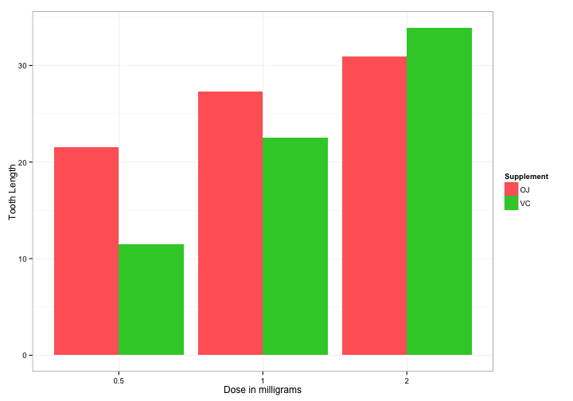

Statistical Inference Project 2
===============================
by `EricRybicki`

# Basic inferential data analysis

In this case we will explore the effect of Vitamin C on tooth growth in Guinea Pig.

## Load and Exploratory Analysis


```r
library(datasets)
?ToothGrowth
```
### Description
The response is the length of odontoblasts (teeth) in each of 10 guinea pigs at each of three dose levels of Vitamin C (0.5, 1, and 2 mg) with each of two delivery methods (orange juice or ascorbic acid).

#### Format
A data frame with 60 observations on 3 variables.

`[,1] len	numeric	Tooth length`

`[,2] supp	factor	Supplement type (VC or OJ).`

`[,3] dose	numeric	Dose in milligrams.`


```r
tooth <- ToothGrowth
str(tooth)
```

```
## 'data.frame':	60 obs. of  3 variables:
##  $ len : num  4.2 11.5 7.3 5.8 6.4 10 11.2 11.2 5.2 7 ...
##  $ supp: Factor w/ 2 levels "OJ","VC": 2 2 2 2 2 2 2 2 2 2 ...
##  $ dose: num  0.5 0.5 0.5 0.5 0.5 0.5 0.5 0.5 0.5 0.5 ...
```

```r
head(tooth)
```

```
##    len supp dose
## 1  4.2   VC  0.5
## 2 11.5   VC  0.5
## 3  7.3   VC  0.5
## 4  5.8   VC  0.5
## 5  6.4   VC  0.5
## 6 10.0   VC  0.5
```

## Provide a basic summary of the data.

```r
library(knitr)
kable(summary(tooth))
```


|   |     len        |supp    |     dose       |
|:--|:---------------|:-------|:---------------|
|   |Min.   : 4.20   |OJ:30   |Min.   :0.500   |
|   |1st Qu.:13.07   |VC:30   |1st Qu.:0.500   |
|   |Median :19.25   |NA      |Median :1.000   |
|   |Mean   :18.81   |NA      |Mean   :1.167   |
|   |3rd Qu.:25.27   |NA      |3rd Qu.:2.000   |
|   |Max.   :33.90   |NA      |Max.   :2.000   |


```r
library(ggplot2)
g <- ggplot(tooth, aes(as.factor(dose), len, fill = supp))
g <- g + geom_bar(stat="identity", position = "dodge") + theme_bw()
g <- g + scale_fill_manual("Teams",values = c("#ff6666", "#33cc33"), guide = guide_legend(title = "Supplement"))
g <- g + xlab("Dose in milligrams") + ylab("Tooth Length")
g
```

 

## Use confidence intervals and hypothesis tests to compare tooth growth by supp and dose.

```r
t.test(len ~ supp, data = tooth)
```

```
## 
## 	Welch Two Sample t-test
## 
## data:  len by supp
## t = 1.9153, df = 55.309, p-value = 0.06063
## alternative hypothesis: true difference in means is not equal to 0
## 95 percent confidence interval:
##  -0.1710156  7.5710156
## sample estimates:
## mean in group OJ mean in group VC 
##         20.66333         16.96333
```
From confidence intervals containing zero and p-value of 0.06, we cannot assume that there are differences in tooth growth due to OJ and VC supplements.


```r
tooth_0.5_1.0 <- subset(tooth, dose %in% c(0.5, 1.0))
t.test(len ~ supp, tooth_0.5_1.0)
```

```
## 
## 	Welch Two Sample t-test
## 
## data:  len by supp
## t = 3.0503, df = 36.553, p-value = 0.004239
## alternative hypothesis: true difference in means is not equal to 0
## 95 percent confidence interval:
##  1.875234 9.304766
## sample estimates:
## mean in group OJ mean in group VC 
##           17.965           12.375
```

```r
tooth_0.5_2.0 <- subset(tooth, dose %in% c(0.5, 2.0))
t.test(len ~ supp, tooth_0.5_2.0)
```

```
## 
## 	Welch Two Sample t-test
## 
## data:  len by supp
## t = 0.9216, df = 35.105, p-value = 0.363
## alternative hypothesis: true difference in means is not equal to 0
## 95 percent confidence interval:
##  -3.10849  8.27849
## sample estimates:
## mean in group OJ mean in group VC 
##           19.645           17.060
```

```r
tooth_1.0_2.0 <- subset(tooth, dose %in% c(1.0, 2.0))
t.test(len ~ supp, tooth_1.0_2.0)
```

```
## 
## 	Welch Two Sample t-test
## 
## data:  len by supp
## t = 1.8397, df = 31.273, p-value = 0.07533
## alternative hypothesis: true difference in means is not equal to 0
## 95 percent confidence interval:
##  -0.3166175  6.1666175
## sample estimates:
## mean in group OJ mean in group VC 
##           24.380           21.455
```

From the selection of t.tests on dosage pairs we can note the low p-values and non-zero confidence values. As a consequence we can confirm that the key component of tooth growth, with regard to supplements, is dosage. 

## Conclusion

To recap, based on the analysis above, we can conclude that across both supplements a higher dosage will have a higher tooth growth rate. However, we cannot say that orange juice and vitamin C have obvious different impact on tooth growth.

